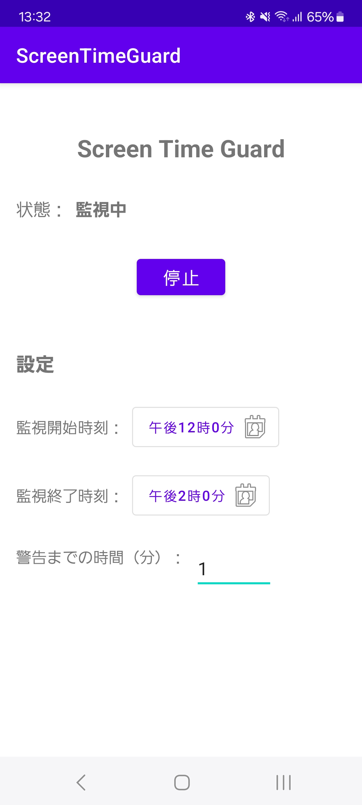

# [kotlin]Androidでスマートフォンの使い過ぎを警告するアプリを作ってみた

どうもこんにちは！
ご覧いただきありがとうございます。
エンジニアをやっているまるさんかく(@Marusankaku_E)と申します。

## 背景

「明日は早く起きないと...」と思いながらもスマホを手に取り、気づいたら深夜...なんて経験ありませんか？

私も最近、夜更かしの原因を振り返ってみると、ほとんどがスマホの使い過ぎでした。特にYouTubeやSNSなど、時間を忘れてしまうようなコンテンツを見始めてしまうともうダメです。「あと1本だけ」が3本になり、「あと5分だけ」が1時間になってしまう...。

そこで、特定の時間以上スマホを使用しているときに警告してくれるアプリを作ってみることにしました。

## 概要

スマートフォン使用を監視し、一定時間以上の使用を検知すると警告通知を表示するAndroidアプリケーションです。


アプリの特徴：
- バックグラウンドでの継続的な監視
- カスタマイズ可能な監視時間帯と警告閾値

## 機能

### 1. 画面使用時間の監視
- 設定された時間帯の画面ONの状態を監視
- 画面がONになってからの経過時間を計測

### 2. 監視の設定機能
- 監視時間帯の開始・終了時刻を設定可能
- 警告を表示するまでの使用時間閾値を設定可能（デフォルト30分）

### 3. 警告通知
- 設定された閾値を超えて画面を使用した場合に通知を表示
-  ２回目以降の通知は5分間隔で実行

### 4. バックグラウンド動作
- フォアグラウンドサービスとして常駐
- システムによる終了時の自動再起動機能

## 使い方

1. アプリを起動し、必要に応じて以下の設定を行います：
   - 監視開始時刻（デフォルト：22:00）
   - 監視終了時刻（デフォルト：06:00）
   - 警告までの時間（デフォルト：30分）

2. 「開始」ボタンをタップして監視を開始します。

3. 設定した時間帯に長時間スマートフォンを使用すると警告通知が表示されます。

4. 監視を停止する場合は「停止」ボタンをタップすることで通知が出現しなくなります。

## コード

主要な実装部分を紹介します。
プロジェクト全体は下記に保存しています。
apkも保存したので、興味ある人は使用してみてください。

- [GitHubリポジトリ](https://github.com/MaruSankakuEngineer/ScreenTimeGuard)

- [apkファイル](https://github.com/MaruSankakuEngineer/ScreenTimeGuard/tree/master/Qiita%E8%A8%98%E4%BA%8B/apk)


### 1. フォアグラウンドサービス

画面の監視を行うサービスクラスです：

```kotlin
class ScreenMonitorService : Service() {
    private var screenOnStartTime = 0L
    private var isScreenOn = false
    private lateinit var powerManager: PowerManager
    private lateinit var notificationManager: NotificationManager
    private lateinit var monitoringStartTime: LocalTime
    private lateinit var monitoringEndTime: LocalTime
    private var warningThresholdMinutes: Int = 30
    private val timeFormatter = DateTimeFormatter.ofPattern("HH:mm")
    private var lastWarningTime = 0L
    private var handler: Handler? = null
    private var runnable: Runnable? = null
    private var lastMonitoringDate: LocalDate? = null  // 最後の監視開始日を記録
    private var totalScreenTimeToday = 0L  // 監視開始からの累計スクリーンタイム

    override fun onStartCommand(intent: Intent?, flags: Int, startId: Int): Int {
        try {
            // SharedPreferencesから設定を読み込む
            val prefs = getSharedPreferences("settings", Context.MODE_PRIVATE)
            val startTimeStr = prefs.getString(MainActivity.PREF_START_TIME, "22:00") ?: "22:00"
            val endTimeStr = prefs.getString(MainActivity.PREF_END_TIME, "06:00") ?: "06:00"
            warningThresholdMinutes = prefs.getInt(MainActivity.PREF_THRESHOLD, 30)

            monitoringStartTime = LocalTime.parse(startTimeStr, timeFormatter)
            monitoringEndTime = LocalTime.parse(endTimeStr, timeFormatter)

            // 監視が有効な場合のみサービスを開始
            if (prefs.getBoolean(MainActivity.PREF_IS_MONITORING_ENABLED, false)) {
                // フォアグラウンドサービスとして開始（通知なし）
                startForeground(NOTIFICATION_ID, createSilentNotification())
                
                // スクリーンの状態を定期的にチェック
                runnable?.let { handler?.removeCallbacks(it) }
                runnable = object : Runnable {
                    override fun run() {
                        checkScreenState()
                        handler?.postDelayed(this, 1000)
                    }
                }
                handler?.postDelayed(runnable!!, 1000)
            }
        } catch (e: Exception) {
            Log.e(TAG, "Error starting service", e)
            stopSelf()
        }
        return START_STICKY
    }
}
```

### 2. 画面状態の監視と通知制御

定期的に画面の状態をチェックし、使用時間を計測します。また、監視開始時の通知と警告通知を制御します：

```kotlin
private fun checkScreenState() {
    val currentTime = LocalTime.now()
    val currentDate = LocalDate.now()
    val isWithinMonitoringHours = if (monitoringStartTime.isBefore(monitoringEndTime)) {
        currentTime.isAfter(monitoringStartTime) && currentTime.isBefore(monitoringEndTime)
    } else {
        currentTime.isAfter(monitoringStartTime) || currentTime.isBefore(monitoringEndTime)
    }

    // 監視時間外になった時の処理
    if (!isWithinMonitoringHours) {
        if (this.isScreenOn) {
            // 画面がONの場合、最後の使用時間を加算
            val finalSessionDuration = TimeUnit.MILLISECONDS.toMinutes(
                System.currentTimeMillis() - screenOnStartTime
            )
            totalScreenTimeToday += finalSessionDuration
            Log.d(TAG, "Final screen time before monitoring end: $totalScreenTimeToday minutes")
        }
        // 監視時間外の場合、状態をリセット
        this.isScreenOn = powerManager.isInteractive
        screenOnStartTime = 0L
        lastWarningTime = 0L
        totalScreenTimeToday = 0L  // 監視時間外になったら累計時間をリセット
        lastMonitoringDate = null
        return  // 監視時間外の場合は以降の処理をスキップ
    }

    // 監視開始時刻になったときの処理（監視時間内の場合のみ）
    if (lastMonitoringDate == null || !currentDate.isEqual(lastMonitoringDate)) {
        // 新しい日の監視開始時に通知を表示し、累計時間をリセット
        notificationManager.notify(
            NOTIFICATION_ID,
            createNotification("スクリーン監視中\n監視時間: ${timeFormatter.format(monitoringStartTime)} - ${timeFormatter.format(monitoringEndTime)}")
        )
        lastMonitoringDate = currentDate
        totalScreenTimeToday = 0L  // 新しい日の監視開始時に累計時間をリセット
        Log.d(TAG, "Started monitoring for new day: $currentDate")
    }

    val isScreenOn = powerManager.isInteractive

    if (isScreenOn && !this.isScreenOn) {
        // 画面がONになった時
        screenOnStartTime = System.currentTimeMillis()
        this.isScreenOn = true
        Log.d(TAG, "Screen turned ON at ${LocalTime.now()}")
    } else if (!isScreenOn && this.isScreenOn) {
        // 画面がOFFになった時
        this.isScreenOn = false
        if (screenOnStartTime > 0) {  // 監視開始後の画面OFFのみカウント
            val currentSessionDuration = TimeUnit.MILLISECONDS.toMinutes(
                System.currentTimeMillis() - screenOnStartTime
            )
            totalScreenTimeToday += currentSessionDuration
            Log.d(TAG, "Screen turned OFF at ${LocalTime.now()}, Total screen time today: $totalScreenTimeToday minutes")
        }
        screenOnStartTime = 0L  // 次回の画面ON時の計測のためにリセット
    } else if (isScreenOn) {
        // 画面ON中の処理
        if (screenOnStartTime > 0) {  // 監視開始後の画面ONのみカウント
            val currentSessionDuration = TimeUnit.MILLISECONDS.toMinutes(
                System.currentTimeMillis() - screenOnStartTime
            )
            val totalDuration = totalScreenTimeToday + currentSessionDuration
            
            if (totalDuration >= warningThresholdMinutes) {
                // 警告通知の表示判定
                val shouldShowWarning = if (lastWarningTime == 0L) {
                    true  // 初回は即座に警告
                } else {
                    val timeSinceLastWarning = TimeUnit.MILLISECONDS.toMinutes(
                        System.currentTimeMillis() - lastWarningTime
                    )
                    timeSinceLastWarning >= WARNING_INTERVAL_MINUTES
                }
                
                if (shouldShowWarning) {
                    showWarningNotification(totalDuration)
                    lastWarningTime = System.currentTimeMillis()
                    Log.d(TAG, "Warning notification shown at ${LocalTime.now()} for total duration: $totalDuration minutes")
                }
            }
        }
    }
}
```

### 3. 通知の実装

サービスの状態と警告のための通知を実装します：

```kotlin
private fun createSilentNotification(): Notification {
    return NotificationCompat.Builder(this, NOTIFICATION_CHANNEL_ID)
        .setContentTitle("Screen Time Guard")
        .setContentText("監視実行中")
        .setSmallIcon(android.R.drawable.ic_dialog_info)
        .setPriority(NotificationCompat.PRIORITY_MIN)
        .setShowWhen(false)
        .build()
}

private fun createNotification(contentText: String): Notification {
    return NotificationCompat.Builder(this, NOTIFICATION_CHANNEL_ID)
        .setContentTitle("Screen Time Guard")
        .setContentText(contentText)
        .setSmallIcon(android.R.drawable.ic_dialog_info)
        .setPriority(NotificationCompat.PRIORITY_DEFAULT)
        .setShowWhen(false)
        .build()
}

private fun showWarningNotification(duration: Long) {
    val message = "監視開始：${timeFormatter.format(monitoringStartTime)}\n" +
            "監視からの累計使用時間：${duration}分"
    
    notificationManager.notify(
        WARNING_NOTIFICATION_ID,
        createWarningNotification(message)
    )
}

private fun createWarningNotification(message: String): Notification {
    return NotificationCompat.Builder(this, NOTIFICATION_CHANNEL_ID)
        .setContentTitle("長時間の使用警告")
        .setContentText(message)
        .setSmallIcon(android.R.drawable.ic_dialog_alert)
        .setPriority(NotificationCompat.PRIORITY_HIGH)
        .setVibrate(longArrayOf(0, 500, 250, 500))
        .setLights(Color.RED, 3000, 3000)
        .setAutoCancel(true)
        .build()
}
```

## 実際の動作

アプリ起動画面


監視中画面



監視開始通知


警告通知


## まとめ

スクリーンタイムを参照して定期的に通知を送信してくれるアプリを作成しました。
決めた時間以上触っている場合は通知が頻繁に飛んでくるようになるので、なかなか煩わしい気持ちになります。
通知送信の仕組みはいろんなことに応用可能だと思うので、皆さんも一度作ってみてはいかがでしょうか


## 参考サイト

- [Android Developers - フォアグラウンド サービス](https://developer.android.com/guide/components/foreground-services)
- [Android Developers - 通知の概要](https://developer.android.com/guide/topics/ui/notifiers/notifications)
- [Android Developers - バックグラウンドでの処理の最適化](https://developer.android.com/guide/background)
- [Android Developers - AlarmManager](https://developer.android.com/reference/android/app/AlarmManager)

